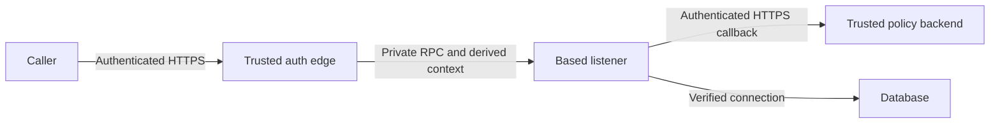

# Deploying the standalone service behind a trusted edge

`based serve` is a database RPC listener, not an authenticator. It trusts
`X-Based-Context` and `X-Based-Shard-Key`. Before exposing any operation, put a
trusted authentication edge in front and prevent callers from reaching the listener
or its guard callbacks directly. The CLI binds `127.0.0.1:8080` by default; the
container binds `0.0.0.0:8080` **inside** its network namespace.

## A concrete edge and its trust boundary

Run the [TypeScript orders example](../examples/standalone-typescript-guards/README.md):

```sh
cd examples/standalone-typescript-guards
npm ci
npm run demo
```

The example's [identity lookup](../examples/standalone-typescript-guards/src/identity.ts)
authenticates local demo credentials and selects the tenant/user on the server.
Its [edge](../examples/standalone-typescript-guards/src/edge.ts) accepts only the
order mutation and scoped order query. It constructs a new header map containing
`Content-Type`, server-derived `X-Based-Context`, and an optional `Idempotency-Key`.
It forwards no caller-supplied `X-Based-*`, authorization, or permission headers.
Thus a viewer supplying buyer context and a forged shard key remains a viewer.
The internal tenant-creation operation is unavailable through the edge.



Replace demo credentials with verified sessions and authorization of tenant
membership. At a public ingress, terminate TLS and pass authenticated requests to
this edge; inbound transport security alone does not establish identity. Rebuild
headers after authentication rather than trusting or appending client context.
Do not accept a shard override from a user: ordinary routing derives its key from
the schema's owning context field. A deliberate override belongs to the trusted
operator/application and must agree with its data placement policy.

Protect the private boundary with deployment networking. On one dedicated host,
keep the listener and callback on loopback behind the edge. Loopback does not
isolate mutually untrusted local users. In containers, put the listener and edge on
a private network and publish only the edge; do not publish the listener port.
For local container diagnostics, bind the host port specifically to loopback:
`-p 127.0.0.1:8080:8080`. Firewall or network-policy rules must deny bypass paths.
Keep health probes on the private operational network too.

The executable scenario inspects a controlled upstream to prove that only
server-derived context crosses the edge; forged context, shard, verdict and
authorization headers do not. It rejects unsigned edge requests and verifies that a private scoped query without its required
context returns `400 missing_ctx`. Optional context follows its declared schema
semantics, including null matching; see [scope contracts](scope-contracts.md).

## Database and callback connections

Configure [certificate-verified database TLS](database-tls.md) on every Postgres
or MariaDB shard. The CLI enables the TLS backend, but you must explicitly choose
`sslmode=verify-full` or `ssl-mode=VERIFY_IDENTITY` and trusted CA/hostname settings.
Use deployment secrets for connection URLs and absolute CA paths (container paths
inside a container). Mount schema and CA assets read-only; SQLite data needs a
separate writable volume. SQLite uses no network database connection.

A schema declaring guards requires a mapping for **every** guard before startup.
Supply `--guard-config guards.toml` with operator-owned endpoints, named secret
environment variables, and deadlines. See [guard configuration](standalone-guards.md)
for the exact TOML and [protocol](../spec/external-guards.md). Missing or invalid
mappings reject startup before store-table setup or binding. Endpoints and
credentials never come from args, context, or incoming headers.

Callbacks authenticate the configured bearer credential before examining the
body. HTTPS verifies certificate and hostname; HTTP requires the explicit
loopback-only development exception. Valid allow proceeds, valid deny returns
`403 guard_denied`, and authentication, timeout, disconnect, redirect, malformed
or oversized responses deny with `Guard check unavailable`. Failed checks write
nothing and consume no idempotency key. The example verifies a forged callback
credential is rejected and stopping the callback denies even a stored replay.

Keep callbacks read-only and repeatable. A data-reading callback needs a restricted
query-only service identity: authenticate it at the edge, authorize tenant/user
context, strip incoming context/shard headers, and limit routes and result sizes.
Never expose the listener directly as its data-read interface or let callback
body values become trusted context without authorization. These reads do not
join the mutation transaction; enforce state invariants with database conditions
or locks, as in the [embedded helpdesk guard](../examples/axum-helpdesk/README.md).

## Configuration ownership

| Concern | Standalone CLI | Embedded Rust |
| --- | --- | --- |
| Listener and identity | `--listen` / `BASED_LISTEN`; trusted header reader behind your edge | Application owns identity/context; optional listener takes `ContextSource` and `ServeConfig` |
| Server-driver pools | `--pool-min` (4), `--pool-max` (32), per physical shard | `PoolConfig` or application-owned SQLx pools |
| Server-driver timeouts | Fixed defaults: 5s checkout and 30s per statement; no CLI timeout flags | `PoolConfig.checkout_timeout` / `statement_timeout`, or owned pool/session configuration |
| SQLite pool | File-backend maximum 5; CLI pool flags do not resize it | `in_memory` uses one shared connection; `open_with_pool` or `from_pool` controls file pools |
| Guards | `--guard-config`, process secret environment variables, explicit development HTTP flag | `Guards` closures or optional `external-guards` adapter |
| Mutation replay | `database` (default), `memory`, `none`; explicit store-table initialization | `Engine::with_store`; explicitly select store and provision its table |
| Shutdown | CLI signal handler requests listener drain | Host owns process signals, listener `Handle`, and application shutdown |

[Database replay](standalone-idempotency.md) commits key, database effects and
response atomically and supports matching retries across instances/restarts.
Provision `_based_idempotency` on every shard before normal startup, using reviewed
migration/setup steps or explicit `--init-idempotency-table`. The CLI does not
silently initialize it. Database keys remain until explicitly deleted; plan
retention and capacity. `memory` is process-local, loses keys on restart and has a
commit-to-record gap; `none` executes every request. Embedded engines default to
memory unless the application injects another store. Queries and unkeyed mutations
receive no deduplication guarantee. Neither store makes external effects exactly once.

## Resource limits, probes, and shutdown

The listener caps each argument body at 1 MiB. External callbacks cap their encoded
request at 256 KiB and response at 16 KiB; their default total deadline is 2s and
maximum configurable deadline is 30s. SQLite's built-in busy timeout is 5s; its
pool checkout uses SQLx's 30s default unless an embedding host supplies its own pool.

Pool limits bound active **database connections**, not accepted HTTP requests,
queued work, concurrent callbacks, response size, or query row counts. Set request
concurrency/queue limits, rate limits, header limits, request deadlines and output
bounds at your proxy/application; use appropriately bounded schema queries.
Streaming queries retain a database connection until completion or stream drop.
The listener supplies no global HTTP request deadline or forced drain deadline.

`GET /healthz` answers 200 without checking the database. `GET /readyz` checks the
backend and returns 503 when unavailable or draining; it does not probe callbacks
or validate the authentication edge. After `Handle::shutdown`,
readiness fails and new RPC calls are rejected, while the socket stays open for a
fixed one-second drain window. It then stops accepting and waits for in-flight
handlers to finish. Coordinate load-balancer removal and process termination grace;
this mechanism alone does not promise a zero-downtime deployment.
The CLI normally wires SIGTERM/SIGINT to this handle and reports signal-handler
installation failures. An embedding host must wire its own signals.

A proxy timeout or client disconnect is not proof of rollback. Axum does not promise
that disconnect cancels a running handler. Cancelling the dispatch future drops an
outbound guard future before writing, but cannot undo work already received by the
callback. For ambiguous database outcomes, retry the same durable key, arguments,
trusted context and database routing rather than guessing whether a write committed.
